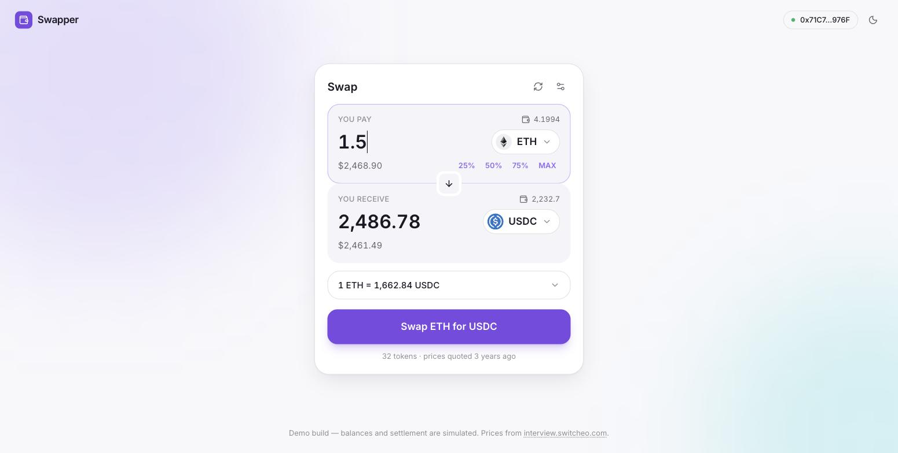
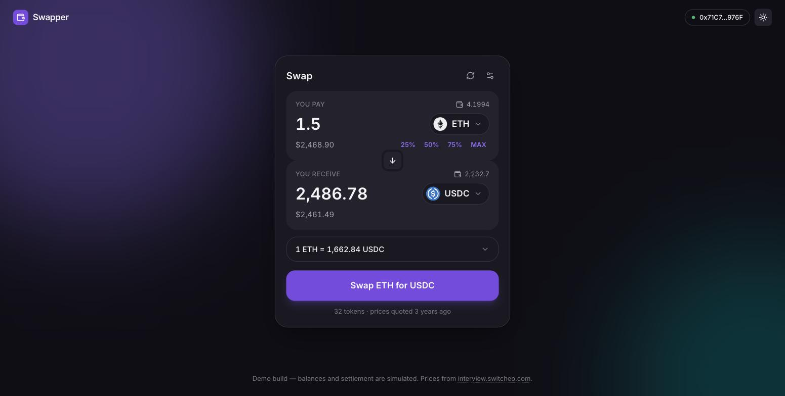

# Problem 2 — Fancy Form

A currency swap form built with **Vite + React 19 + TypeScript + Tailwind 4**.

**Live: [s5tech.duelcode.online](https://s5tech.duelcode.online)**

- **95 tests**, including a full user-journey suite driven through the real DOM
- Real data: prices from `interview.switcheo.com`, icons from `Switcheo/token-icons`
- Light and dark themes, responsive to 320px, keyboard- and screen-reader-navigable
- Exact decimal arithmetic — no `parseFloat` touches a monetary amount anywhere

| Light | Dark |
|---|---|
|  |  |

## Run

```bash
cd src/problem2
npm install
npm run dev        # http://localhost:5173
```

```bash
npm test           # vitest — 95 tests
npm run typecheck  # tsc -b, strict + noUncheckedIndexedAccess
npm run lint       # oxlint — clean
npm run build      # production build
npm run deploy     # build + deploy to Cloudflare (see below)
```

## Deployment

Deployed to Cloudflare as an **assets-only Worker** — no server code, since the
price feed is a third-party URL the browser fetches directly, so the whole app
is static files served from the edge.

```bash
wrangler login       # once, per machine
npm run deploy       # tsc -b && vite build && wrangler deploy
```

[`wrangler.jsonc`](./wrangler.jsonc) declares the custom domain, so the DNS
record in the `duelcode.online` zone is managed by the deploy rather than by
hand. `not_found_handling: "single-page-application"` makes a deep link or a
refresh on any route return `index.html` instead of a 404 — the router is on the
client.

> **Bonus claimed:** built with [Vite](https://vite.dev/), as the brief suggests.

---

## What it does

**Swap flow** — pick a pair, type an amount, get a live quote, submit, get a receipt.
The direction toggle flips both legs and carries the quoted output across as the
new input, because "now go the other way with roughly this much" is what people
actually mean when they hit it.

**Token picker** — searchable dialog, quick-pick row of popular tokens, and every
row showing your balance and its USD value. The list is **sorted by wallet
value**: the token you hold most of is the one you are most likely to want. The
token already on the other leg is shown *disabled and labelled "In use"* rather
than hidden — a row that silently vanishes reads as a bug.

**Quote disclosure** — the rate is always visible; expected output, minimum
received, price impact, fee and both USD legs are one tap away. A swap UI that
hides fees and price impact is hiding exactly the numbers that cost users money.

**Slippage settings** — presets plus a custom field, with warnings at both ends
of the range (too low fails, too high costs you).

**Amount shortcuts** — 25 / 50 / 75 / MAX, only shown when there is a balance.

---

## Decisions worth defending

### Money never becomes a JavaScript number

Every amount is a string from keystroke to submission, with arithmetic done in
BigInt ([`src/lib/decimal.ts`](./src/lib/decimal.ts)). `0.1 + 0.2` is
`0.30000000000000004`, and an 18-decimal token amount has more significant digits
than a double holds. In a swap form the specific failure is nasty: a user clicks
**MAX**, the float rounds their balance *up* in the last place, and the form then
rejects them for having insufficient funds of their own money. There is a test
pinning exactly that.

### The price feed is validated, not trusted

It is a third-party endpoint we do not control, so the response is parsed with
Zod. A shape change surfaces as one readable error state instead of `undefined`
propagating into a rate calculation and rendering `NaN` in a fiat column.

### Two real quirks in the live data, both handled

1. **The feed contains duplicates** — 36 entries for 32 currencies (BUSD appears
   twice, with different prices). Taking the last-seen entry would make the
   displayed rate depend on array order, so **the most recent `date` wins**.
   Tested by feeding the fixture in reverse and asserting the same result.
2. **The icon repository disagrees with the feed on casing** — the feed says
   `STATOM`, the file is `stATOM.svg`, and raw GitHub paths are case-sensitive.
   Five tokens would silently fall back to a placeholder. There is a small
   verified alias map, and any icon that still fails renders a deterministic
   monogram rather than a broken-image glyph.

Tokens with no usable price are dropped rather than offered and then failing at
quote time — the brief permits omitting them.

### `type="text"` with `inputMode="decimal"`, not `type="number"`

A number input silently discards values the browser dislikes, cannot hold the
partial `"1."` state that real typing produces, and ships spinners nobody wants
on a token amount. The field sanitises per keystroke (rejecting a second decimal
point, capping at 18 places, stripping `007` → `7`) and validates on commit —
two different jobs, kept separate.

### Validation waits until you have touched the field

Flagging "enter an amount" on an untouched input is nagging, not helping. It
validates on blur, then live from that point on. Messages are actionable:
*"Not enough ETH — you have 4.1994"*, not *"Invalid input"*. The message appears
twice by design — in a live region for screen readers, and as the submit button's
own label for everyone else, so the button always says why it is disabled.

### Server state is TanStack Query's job

Caching, retry with backoff, deduplication and a real `isError` to design around.
The retry *policy* lives on the QueryClient rather than in the hook, so tests can
render against a client with retries off — a hook-level `retry: 2` overrides the
client and turns every error-path assertion into a multi-second timeout.

### The mocked backend fails ~12% of the time

Deliberate. A form that has only ever been seen succeeding has an untested error
state, and that error state is what a user meets on their worst day. Both
outcomes are pinned in the suite by stubbing `Math.random`.

### Accessibility is not a pass at the end

Radix primitives for the dialog and popover (focus trapping, `Escape`, scroll
lock, focus restoration), a visible focus ring that is never removed, live
regions for errors, `aria-busy` on the submitting button, decorative artwork
marked `aria-hidden`, and `prefers-reduced-motion` honoured. Opening the token
dialog focuses the search box, not the close button — typing is what you came to
do.

---

## Testing

```
✓ src/lib/decimal.test.ts               (27)
✓ src/lib/tokens.test.ts                (12)
✓ src/lib/swap.test.ts                  (14)
✓ src/features/swap/swap-schema.test.ts (19)
✓ src/features/swap/SwapCard.test.tsx   (23)
  95 passed
```

Network calls are intercepted with **MSW**, not by mocking `fetch`. Mocking fetch
tests that the mock agrees with the code; intercepting at the network layer
exercises the real query function, the real Zod parsing and the real error paths.
The fixture deliberately keeps the awkward parts of the live feed — a duplicated
currency and an unpriceable token — because testing against a tidied-up fixture
is how the duplicate-handling bug ships.

The component suite drives the form the way a person does — type, tab, click —
and asserts on roles and labels rather than test ids, so it fails if the UI stops
being navigable. It covers the loading skeleton, feed failure and recovery, a
malformed feed, quoting, disclosure, every validation branch, MAX and the
percentage buttons, the direction toggle, search and filtering in the picker, and
both settlement outcomes.

One test earned its keep during development: `percentOfBalance` at 100% was
rounding to 8 decimal places, so **MAX** on a small balance quoted slightly less
than the user held. Fixed in `src/lib/swap.ts`.

---

## Assumptions declared

- **Balances are mocked**, derived deterministically from a hash of the symbol so
  they are stable across reloads — a wallet that reshuffles on refresh cannot be
  demoed or tested. Some tokens have a zero balance on purpose, so the empty
  state is reachable. A completed swap visibly moves both balances.
- **Settlement is simulated** with a delay, a resolved transaction hash and a
  failure path. The brief explicitly permits this.
- **The 0.3% fee and price impact are illustrative.** The feed is a static file
  of quotes from one date, so there is no real liquidity depth to model. The
  footer says so rather than implying the prices are live — a user comparing this
  rate against a real exchange deserves to know why they differ.
- **No wallet connection.** The header shows a fixed address; connecting a real
  wallet is outside a form exercise.
- The brief said to feel free to disregard the provided skeleton files for this
  problem, so this is a fresh Vite app.

## What I would do next

1. **Code-split the bundle** — 160 kB gzipped is acceptable but not tight; the
   token dialog and its Radix dependency are an obvious lazy boundary.
2. **Virtualise the token list** if it ever grows past a few hundred entries.
3. **Reverse quoting** — type in the "You receive" field and solve backwards.
4. **A real slippage/deadline simulation**, once there is a backend that can
   actually reject a stale quote.
5. **Playwright smoke tests** across browsers; the current suite is jsdom, which
   cannot catch a real layout or focus bug.
