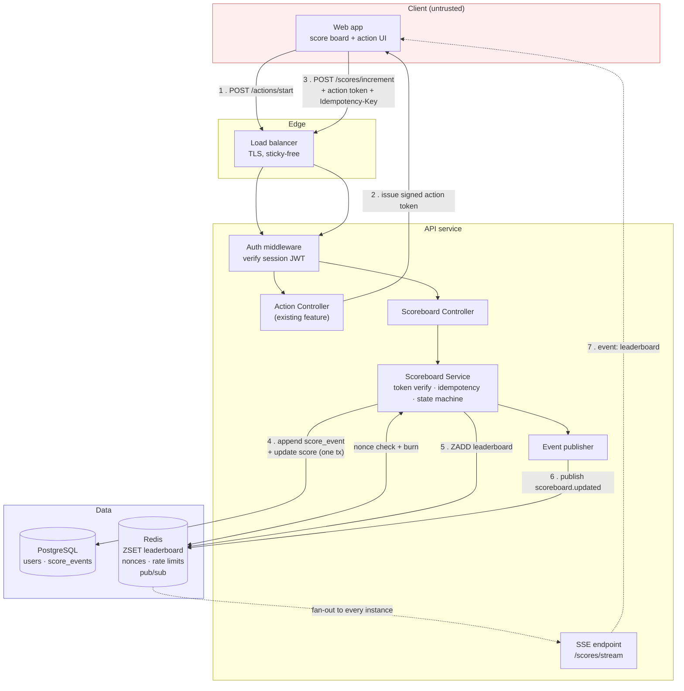
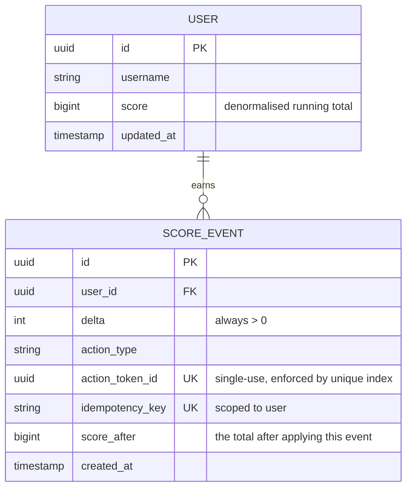
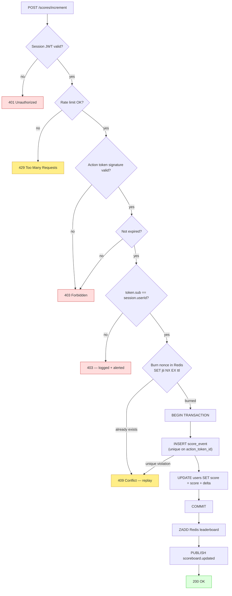
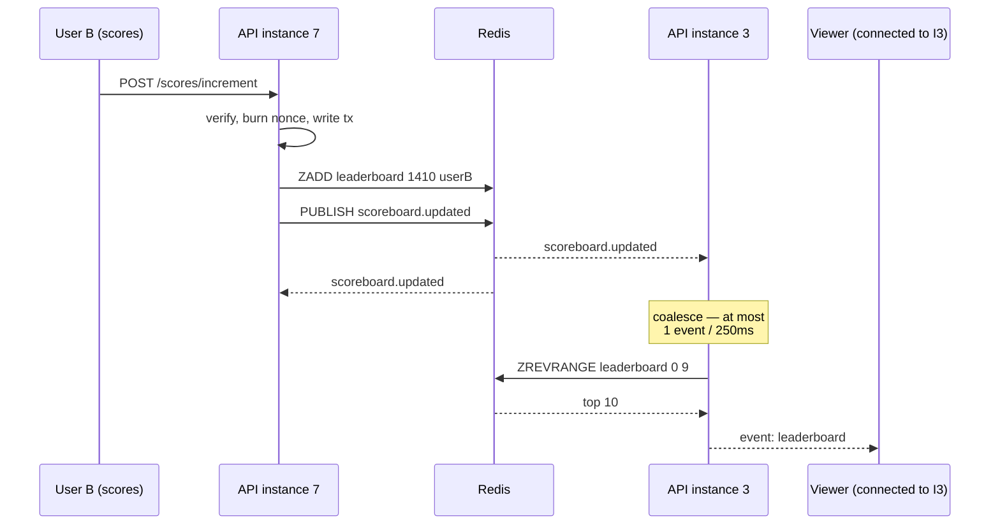

# Scoreboard Module — Software Specification

**Status:** Ready for implementation
**Audience:** Backend engineering team
**Version:** 1.0

Diagrams are inline as Mermaid and also rendered to SVG in
[`diagrams/`](./diagrams) for viewers that do not render Mermaid.

---

## 1. Overview

The **Scoreboard module** owns user scores for the API service. It is responsible
for three things:

1. Accepting authorised score increments produced by a user completing an action.
2. Maintaining the **top 10** leaderboard.
3. Pushing the leaderboard to connected clients **live**, without polling.

The module is deliberately ignorant of what "the action" is. It exposes a
contract — *"here is proof that user U legitimately completed action A"* — and any
number of features can satisfy it.

### Scope

| In scope | Out of scope |
|---|---|
| Score increment endpoint + authorisation | The action itself, and its business rules |
| Top-10 read model and cache | User registration, profile, avatars |
| Live push transport (SSE) | Historical/seasonal leaderboards (see §11) |
| Anti-abuse: action tokens, idempotency, rate limits | Payments, rewards, prize fulfilment |
| Audit trail of every score change | Front-end rendering |

### The central problem

> *"Upon completion the action will dispatch an API call to the application server
> to update the score. We want to prevent malicious users from increasing scores
> without authorisation."*

**A client-dispatched score increment cannot be trusted, in principle.** The
client runs on hardware the attacker controls. Whatever the browser can send,
`curl` can send. Authentication alone does not solve this: a logged-in attacker
authenticates perfectly well and then calls `POST /scores/increment` in a loop.

So the design does **not** ask "is this request from a logged-in user?" It asks
**"is this request the redemption of a specific, server-issued, single-use permit
to score, which has not already been spent?"**

That is the difference between §5 and a system that fails on day one.

---

## 2. Architecture



The dashed path is the live-update fan-out. Note that **the SSE endpoint is on
every API instance** and receives updates via Redis pub/sub — a client connected
to instance 3 must see a score written by instance 7.

---

## 3. Data model



`score_event` is an **append-only ledger**; `user.score` is a denormalised
running total kept in the same transaction. Both are needed:

- The ledger is the source of truth. It answers *"why is this user's score
  1,400?"*, which is exactly the question you must answer when a cheat is
  suspected, and it lets a corrupted total be recomputed by replay.
- The denormalised total makes the common read O(1) instead of an aggregate over
  the ledger.

The `UNIQUE` index on `action_token_id` is the **last line of defence against
replay**. Redis burns the nonce first (§5), but Redis is a cache and can be
flushed; the database constraint cannot be. Belt and braces, because the cost of
being wrong here is a corrupted leaderboard.

```sql
CREATE TABLE score_events (
  id               UUID PRIMARY KEY DEFAULT gen_random_uuid(),
  user_id          UUID NOT NULL REFERENCES users(id) ON DELETE CASCADE,
  delta            INTEGER NOT NULL CHECK (delta > 0),
  action_type      TEXT NOT NULL,
  action_token_id  UUID NOT NULL,
  idempotency_key  TEXT,
  score_after      BIGINT NOT NULL,
  created_at       TIMESTAMPTZ NOT NULL DEFAULT now()
);

-- Replay protection that survives a Redis flush.
CREATE UNIQUE INDEX uq_score_events_token ON score_events (action_token_id);
-- Safe client retries.
CREATE UNIQUE INDEX uq_score_events_idem  ON score_events (user_id, idempotency_key)
  WHERE idempotency_key IS NOT NULL;
-- Per-user history, and the rate-limit lookback.
CREATE INDEX ix_score_events_user_time ON score_events (user_id, created_at DESC);

-- The top-10 read, when Redis is cold. Postgres can serve this from the index alone.
CREATE INDEX ix_users_score_desc ON users (score DESC, id ASC);
```

---

## 4. API

All endpoints require a valid session JWT in `Authorization: Bearer <token>`
unless stated otherwise.

### 4.1 `POST /api/v1/actions/start` — obtain a permit to score

Called when the user *begins* the action. Owned by the action feature, specified
here because the scoreboard depends on its output.

**Response `201`**
```json
{
  "data": {
    "actionToken": "eyJhbGciOiJIUzI1NiIsInR5cCI6IkFDVCJ9…",
    "expiresAt": "2026-09-10T12:34:56Z"
  }
}
```

The token is a short-lived JWT signed with a **separate key** from session
tokens — an action token must never be usable as a session token, or vice versa.

```jsonc
{
  "jti": "b1f0…",          // nonce — single use, burned on redemption
  "sub": "user-uuid",       // bound to the caller; another user cannot redeem it
  "act": "PUZZLE_SOLVED",   // which action, so the server sets the delta
  "iat": 1757500000,
  "exp": 1757500300,        // 5 minutes — long enough to complete, short enough to matter
  "aud": "scoreboard"
}
```

**Note there is no `delta` in the token.** The server maps `act` → points from
its own configuration. If the client could name its own score increment, every
other control in this document would be decoration.

### 4.2 `POST /api/v1/scores/increment` — redeem the permit

**Request**
```http
POST /api/v1/scores/increment
Authorization: Bearer <session jwt>
Idempotency-Key: 6f1c9d2e-…       ; optional but recommended
Content-Type: application/json

{ "actionToken": "eyJhbGciOi…" }
```

**Response `200`**
```json
{
  "data": {
    "userId": "…", "delta": 10, "score": 1410,
    "rank": 4, "leaderboardChanged": true
  }
}
```

| Status | When |
|---|---|
| `200` | Score applied (or the idempotent replay of an applied request). |
| `401` | Missing/invalid session token. |
| `403` | Action token invalid, expired, or `sub` ≠ authenticated user. |
| `409` | Action token already redeemed (**replay attempt**). |
| `422` | Malformed body. |
| `429` | Rate limit exceeded. |

### 4.3 `GET /api/v1/scores/top` — the board

Public (no auth), cacheable.

```json
{
  "data": [ { "rank": 1, "userId": "…", "username": "ada", "score": 9820 } ],
  "meta": { "generatedAt": "2026-09-10T12:34:56Z", "limit": 10 }
}
```

`?limit=` accepts 1–100, default 10.

### 4.4 `GET /api/v1/scores/stream` — live updates (SSE)

`text/event-stream`. On connect the server sends the current board immediately,
so the client needs no separate fetch and has no gap between snapshot and stream.

```
event: leaderboard
id: 1757500123456
data: {"data":[…],"meta":{"generatedAt":"…"}}

: keep-alive
```

- `id:` on every event so a reconnecting browser sends `Last-Event-ID` and the
  server can tell whether the client missed anything.
- A comment line every 15s keeps proxies from closing an idle connection.
- Events are **coalesced** server-side (§7): a burst of 500 score updates
  produces at most one event per 250ms window, not 500.

---

## 5. Security — how a malicious user is actually stopped

This section is the reason the module exists. Each control is listed with the
specific attack it defeats.

### 5.1 Threat model

| # | Attack | Defeated by |
|---|---|---|
| T1 | `curl POST /scores/increment` with a stolen or ordinary session token | **Action token required** (§5.2) |
| T2 | Replaying one captured action token N times | **Nonce burn + unique index** (§5.3) |
| T3 | Forging an action token | **HMAC signature, separate key** (§5.2) |
| T4 | Redeeming *another user's* token | **`sub` binding** (§5.2) |
| T5 | Claiming an arbitrary point value | **Server-side delta**; no `delta` in the request (§4.1) |
| T6 | Automating the real action at machine speed | **Rate limits + anomaly detection** (§5.4, §5.5) |
| T7 | Network retry double-counting (not malicious, same damage) | **Idempotency key** (§5.3) |
| T8 | Two concurrent redemptions of one token | **Atomic burn + DB constraint** (§5.3) |

### 5.2 Action tokens

An increment is only accepted with a token that the server itself issued, for
this user, for this action, minutes ago. Verification order — cheapest first, so
a flood of garbage costs almost nothing:



**Signature before anything expensive.** An unsigned request is rejected with one
HMAC verification — no database round trip. This is what keeps a flood cheap.

### 5.3 Single use, exactly once

The `jti` nonce is burned with an atomic `SET jti "1" NX EX <ttl>`. `NX` makes
"check and burn" one operation, so two concurrent redemptions of the same token
cannot both see it unburned — the classic TOCTOU race, and the one an attacker
will actually try.

The `UNIQUE` index on `score_events.action_token_id` is the backstop for when
Redis is unavailable or has been flushed. **Never rely on a cache for a
correctness invariant.**

Separately, `Idempotency-Key` protects the *honest* client: a request that
succeeded but whose response was lost to a dropped connection can be safely
retried, returning the original result rather than scoring twice.

### 5.4 Rate limiting

Two layers, both in Redis so they hold across instances:

| Layer | Limit | Purpose |
|---|---|---|
| Per user, per action type | 10 / minute, 200 / day | Caps a compromised account's damage |
| Per IP | 100 / minute | Caps credential-stuffing and distributed scripting |

Sliding window, not fixed — a fixed window lets a user spend the whole allowance
at 11:59:59 and again at 12:00:00, i.e. double the intended rate at the boundary.

### 5.5 Detection, because prevention is never complete

Every control above raises the cost of cheating; none makes it impossible. The
ledger exists so cheating is *visible*:

- Alert on a user exceeding P99.9 score velocity for their cohort.
- Alert on `403 sub mismatch` and on `409 replay` rates — legitimate clients
  produce near-zero of both, so any volume is signal, not noise.
- Nightly reconciliation: `SUM(score_events.delta) == users.score` per user. A
  mismatch means either a bug or a write that bypassed the service.
- Admin endpoint to void a `score_event` and recompute, so a confirmed cheat can
  be reversed without hand-editing a total.

### 5.6 Residual risk — stated plainly

If the *action itself* can be performed by a script, action tokens do not stop a
determined attacker; they only force them to go through the real flow. **The
strongest control is to make the action's outcome verifiable server-side** (the
server checks the puzzle solution, not the client's claim to have solved it).
That belongs to the action feature, and is called out here so it is a decision
someone makes rather than an oversight. Where the action genuinely cannot be
verified server-side, treat the leaderboard as adversarial and lean on §5.5.

---

## 6. Live updates — why SSE

| | SSE | WebSocket | Polling |
|---|---|---|---|
| Direction | Server → client | Bidirectional | Client-initiated |
| Reconnect | **Automatic**, with `Last-Event-ID` | Hand-rolled | N/A |
| Infrastructure | Plain HTTP/2 | Upgrade handshake, LB config | Trivial |
| Fit for a read-only board | **Exact** | Overkill | Wasteful |

The scoreboard is strictly one-directional: clients read, they never write over
the channel. SSE gives automatic reconnection and replay-position tracking for
free, works through any HTTP proxy, and needs no separate server. **Choose
WebSocket only if the module later needs client→server messages** on the same
channel; the endpoint contract is designed so that swap would not change §4.2.

Polling is rejected: 10k clients at 1s intervals is 10k req/s of mostly identical
responses, and still shows stale data for up to a second.

### Fan-out across instances



Redis pub/sub is what makes horizontal scaling work. Without it, only clients
that happen to be connected to the instance that handled the write would see the
update — which passes every test on one machine and fails silently in production.

---

## 7. The top-10 read model

A Redis **sorted set** (`ZADD` on write, `ZREVRANGE key 0 9` on read) is O(log N)
to update and O(log N + 10) to read, regardless of user count. Postgres remains
the source of truth; Redis is a derived index that can always be rebuilt.

**Cold start / cache loss:** if the key is missing, rebuild from
`SELECT id, username, score FROM users ORDER BY score DESC LIMIT 1000`, using a
short Redis lock so a thundering herd of instances issues one rebuild, not N.

**Event coalescing:** a popular action can produce hundreds of writes per second,
but a human cannot read hundreds of board updates per second. The publisher
debounces on a 250ms window — at most 4 events/second per client, each carrying
the *current* board. This is a correctness property as much as a performance one:
a client that receives only the latest snapshot can never render a stale order.

**Ties:** equal scores are ranked by `id ASC` so the order is stable across reads.
Without a tiebreak the board visibly shuffles between polls for no reason.

---

## 8. Failure modes

| Failure | Behaviour | Rationale |
|---|---|---|
| Redis down | Increments still work: nonce check falls back to the DB unique index, board reads fall back to `ORDER BY score DESC LIMIT 10`. Live updates degrade to a 10s client poll. | Scoring is the critical path; liveness is a nice-to-have. **Never let a cache outage become an outage.** |
| Postgres down | `503` on increment; board served stale from Redis with `meta.stale: true`. | Reading a slightly old board beats a blank page. |
| Redis flushed | Nonces lost, but the DB unique index still rejects replays. | Cache must never hold a correctness invariant alone. |
| Increment succeeds, publish fails | Score is correct; the board updates on the next event or the client's 30s reconciliation fetch. | The transaction is the commit point; the notification is best-effort. |
| SSE connection drops | Browser reconnects automatically; server sends a fresh snapshot on connect. | No gap, no client-side replay logic. |
| Duplicate concurrent redemption | One `200`, one `409`. | `SET NX` + unique index. |

---

## 9. Non-functional requirements

| | Target |
|---|---|
| `POST /scores/increment` | p99 < 150ms |
| `GET /scores/top` (warm) | p99 < 20ms |
| Update → visible on client | < 500ms end-to-end |
| Concurrent SSE connections | 10,000 per instance |
| Availability | 99.9% |
| Audit retention | 12 months of `score_events` |

**Observability.** Every request carries a correlation id, in logs and error
bodies. Metrics: `score_increment_total{result}`, `action_token_rejected_total{reason}`,
`sse_connections_active`, `leaderboard_publish_latency_seconds`. OpenTelemetry
spans across controller → service → database → Redis. The
`action_token_rejected_total{reason="sub_mismatch"}` counter is a security signal,
not a performance one — page on it.

---

## 10. Implementation checklist

- [ ] Migrations: `score_events`, `users.score`, all four indexes in §3
- [ ] `ActionTokenService` — issue + verify, **separate signing key** from sessions
- [ ] `ScoreboardService.increment()` — verify → burn → transaction → publish
- [ ] Redis: nonce burn (`SET NX EX`), leaderboard ZSET, sliding-window limiter
- [ ] `GET /scores/top` with Redis-miss rebuild behind a lock
- [ ] SSE endpoint: snapshot on connect, pub/sub subscribe, 15s keep-alive, 250ms coalescing
- [ ] Idempotency-Key handling on `POST /scores/increment`
- [ ] Metrics, structured logs, OTel spans
- [ ] Nightly reconciliation job (`SUM(delta)` vs `users.score`)
- [ ] Admin: void a score event and recompute

**Tests that must exist.** These are the ones that catch the bugs that matter:
- Replaying one action token twice → exactly one `200`, one `409`, **one** ledger row.
- Two *concurrent* redemptions of the same token → same result (the TOCTOU race).
- User A redeeming user B's token → `403`.
- Expired token → `403`.
- A request naming its own `delta` → the field is ignored, server value applied.
- Redis unavailable → increments still succeed and replays are still rejected.
- A write on instance A reaches an SSE client connected to instance B.
- Rate limit boundary: the 11th request in a minute is `429`.

---

## 11. Comments for improvement

Beyond the specified scope — flagged for the team and product owner:

1. **Verify the action server-side.** §5.6 is the honest limit of this design. If
   the action's outcome can be checked by the server, do that instead; action
   tokens become defence in depth rather than the primary control. **This is the
   single highest-value change available**, and it is a product decision, not an
   engineering one.
2. **Seasonal boards.** `score_events` already carries timestamps, so weekly and
   monthly boards are a windowed query away — and an all-time board that a
   long-standing user can never be dislodged from is a well-known engagement
   problem.
3. **Return the viewer's own rank** on `/scores/top`, even outside the top 10
   (`ZREVRANK`). Users care most about *their* position; without it the board is
   irrelevant to 99.9% of them.
4. **Board of 10 is a magic number.** Make the response `limit`-driven (already
   is) and let the client decide, so the product can change its mind without a
   backend deploy.
5. **Anti-cheat as an async consumer.** The detection in §5.5 can read the
   `score_event` stream out-of-band, so heavier analysis never sits in the
   request path.
6. **Consider Redis Streams over pub/sub** if a client must not miss an event
   across a reconnect. Pub/sub is fire-and-forget; combined with `Last-Event-ID`
   this would give true replay. Not needed while every event carries the *full*
   current board, but it becomes necessary the moment events turn into deltas.
7. **Privacy.** A public leaderboard of usernames is personal data. Confirm the
   product intends users to be identifiable, and offer opt-out — otherwise this
   is a GDPR conversation held after launch instead of before.
